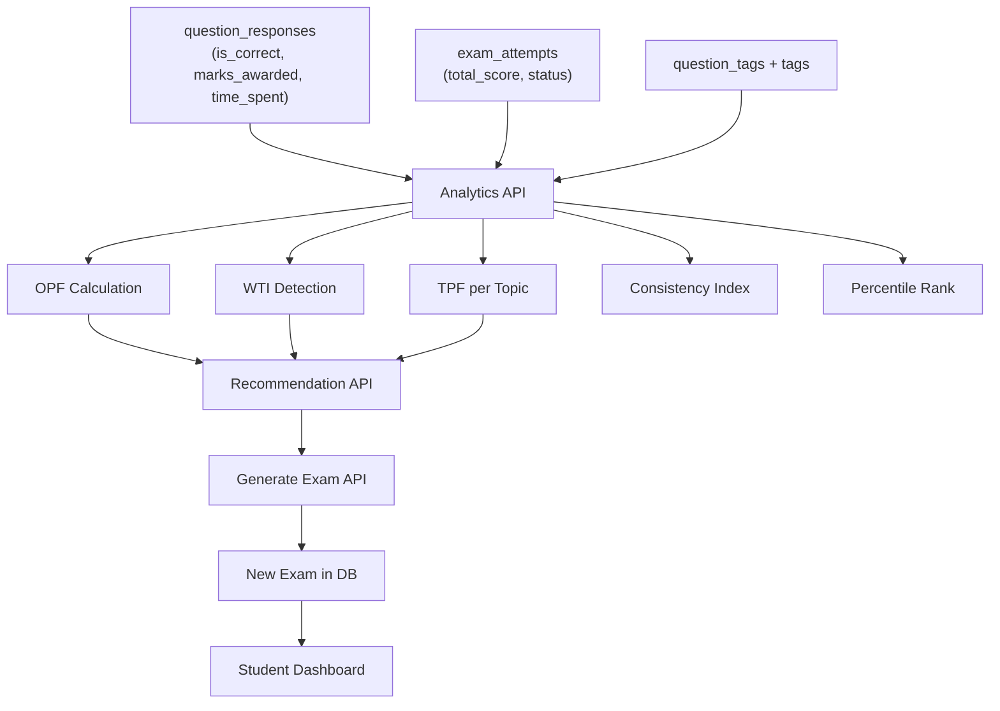

# Custom Exam Generation & Analytics System

## Overview

Build a comprehensive student analytics + recommendation + auto-generation system. Three pillars:
1. **Deep Analytics** — Time, consistency, and comparative performance
2. **Recommendation Engine** — OPF/WTI-based exam suggestions
3. **Auto-Generation** — Build exams from question bank

**Zero changes to existing pages or APIs.**

---

## Part A: Mathematical Formulas

### 1. Overall Performance Factor (OPF)

Weighted average across all topics the student has attempted:

```
OPF = Σ(Wt × Pt) / Σ(Wt)
```

| Symbol | Meaning | Formula |
|--------|---------|---------|
| **Pt** | Topic accuracy | `marks_earned_t / total_possible_marks_t` (0 to 1) |
| **Wt** | Topic weight | `questions_attempted_t / total_questions_attempted` |

> **Example:** 30 Physics (70%), 20 Chemistry (45%), 10 Math (90%)
> OPF = (0.5×0.70 + 0.33×0.45 + 0.17×0.90) / 1.0 = **0.648 (64.8%)**

---

### 2. Weak Topic Index (WTI)

A topic is **weak** if it falls below the student's own adjusted average:

```
WTI_threshold = OPF × α       (α = 0.85, sensitivity factor)
Topic is WEAK if:  Pt < WTI_threshold
weakness_score_t = (WTI_threshold - Pt) / WTI_threshold   (0 to 1)
```

> Chemistry: 0.45 < 0.551 → **Weak** (weakness_score = 0.183)

---

### 3. Time Performance Factor (TPF) — 🆕

Measures speed efficiency per topic. Uses `time_spent` from `question_responses`:

```
Expected_time_t = avg_time_per_question × question_count_t
Actual_time_t   = Σ(time_spent) for topic t
TPF_t = Expected_time_t / Actual_time_t       (capped at 1.5)
```

| TPF Value | Meaning |
|-----------|---------|
| < 0.7     | Too slow — needs more practice |
| 0.7 – 1.0 | Normal pace |
| 1.0 – 1.3 | Efficient |
| > 1.3     | Rushing (flag if accuracy also low) |

**Combined Time-Accuracy Score:**
```
TAS_t = Pt × 0.7 + TPF_t × 0.3
```

This penalizes high-accuracy-but-slow and fast-but-inaccurate students.

---

### 4. Consistency Index (CI) — 🆕

Measures how stable a student's performance is across their last N exams:

```
CI = 1 - (σ / μ)      where σ = std deviation, μ = mean of last N exam percentages
```

| CI Value | Interpretation | Badge |
|----------|---------------|-------|
| > 0.85   | Very Consistent | 🟢 Stable |
| 0.65 – 0.85 | Moderately Consistent | 🟡 Variable |
| < 0.65   | Inconsistent | 🔴 Erratic |

**Trend Detection** using linear regression slope:
```
slope = Σ((xi - x̄)(yi - ȳ)) / Σ((xi - x̄)²)
  where xi = exam index (1,2,3...), yi = percentage
```

| Slope | Trend |
|-------|-------|
| > +2  | 📈 Improving |
| -2 to +2 | ➡️ Stable |
| < -2  | 📉 Declining |

---

### 5. Percentile Rank — 🆕

How a student stands relative to all students who took the same exam:

```sql
PERCENT_RANK() OVER (
    PARTITION BY exam_id 
    ORDER BY total_score ASC
) × 100
```

**Cross-Exam Percentile** (student's overall standing):
```
overall_percentile = AVG(exam_percentile_i) for all submitted exams
```

---

### 6. Difficulty Distribution

Maps OPF → question difficulty mix:

| OPF Range | Easy (1–2) | Medium (2–3) | Hard (3–4) |
|-----------|-----------|-------------|-----------|
| < 40%     | 70%       | 25%         | 5%        |
| 40–60%    | 40%       | 45%         | 15%       |
| 60–80%    | 20%       | 50%         | 30%       |
| > 80%     | 5%        | 45%         | 50%       |

---

### 7. Question Allocation Per Topic

Weak topics get more questions via boosted weights:

```
base_weight_t  = 1 / num_topics
weak_boost_t   = weakness_score_t × β       (β = 2.0)
final_weight_t = base_weight_t + weak_boost_t
normalized_t   = final_weight_t / Σ(all weights)
questions_t    = round(normalized_t × total_questions)
```

---

### 8. No-Repeat Filter

```sql
WHERE q.id NOT IN (
    SELECT qr.question_id FROM question_responses qr
    JOIN exam_attempts ea ON qr.attempt_id = ea.id
    WHERE ea.student_id = ? AND ea.status = 'submitted'
    ORDER BY ea.submitted_at DESC LIMIT 3
)
```

---

## Part B: Proposed Changes

### Database

#### [MODIFY] [schema.sql](file:///Users/charanpreetsingh/LabRecManagemer/merit-entrance/database/schema.sql)

One optional column:

```sql
ALTER TABLE exams ADD COLUMN IF NOT EXISTS source VARCHAR(20) DEFAULT 'admin';
-- Values: 'admin', 'recommended', 'manual_practice'
```

> [!NOTE]
> No other schema changes. `time_spent` already exists in `question_responses`. `total_score` already in `exam_attempts`. All analytics are computed from existing data.

---

### New API Endpoints

#### [NEW] `src/app/api/student/analytics/route.ts`

`GET /api/student/analytics` — Comprehensive analytics endpoint.

**Returns:**
```json
{
  "opf": 0.648,
  "consistency": { "ci": 0.82, "trend": "improving", "slope": 3.2, "scores": [55, 62, 70, 68, 75] },
  "timePerformance": [
    { "tag": "Physics", "avgTimePerQ": 45, "expectedTime": 60, "tpf": 1.33, "tas": 0.89 }
  ],
  "topicBreakdown": [
    { "tag": "Physics", "accuracy": 0.70, "isWeak": false, "tpf": 1.33 }
  ],
  "percentile": { "overall": 72.5, "perExam": [{ "examTitle": "JEE Mock 1", "percentile": 68 }] }
}
```

---

#### [NEW] `src/app/api/student/recommendation/route.ts`

`GET /api/student/recommendation` — Recommendation based on analytics.

**Returns:** recommended exam config (topic weights, difficulty mix, question count, estimated duration).

---

#### [NEW] `src/app/api/student/generate-exam/route.ts`

`POST /api/student/generate-exam` — Creates practice exam.

**Body:** `{ mode: "recommended"|"manual", tagIds?: [], totalQuestions?: 30, scheduledFor?: "ISO" }`

Creates exam → section → pulls questions → creates assignment + optional schedule.

---

#### [NEW] `src/app/api/student/rankings/route.ts`

`GET /api/student/rankings?examId=xxx` — Percentile/rank for a specific exam or overall.

Uses `PERCENT_RANK()` and `DENSE_RANK()` window functions.

---

### Performance Utilities

#### [MODIFY] [performance.ts](file:///Users/charanpreetsingh/LabRecManagemer/merit-entrance/src/lib/performance.ts)

Add ~80 lines:
- `calculateOPF(tagPerformance[])` → number
- `calculateWTI(tagPerformance[], opf)` → WeakTopic[]
- `calculateTPF(topicTimes[])` → TopicTimeFactor[]
- `calculateConsistency(examScores[])` → { ci, trend, slope }
- `getDifficultyDistribution(opf)` → { easy, medium, hard }
- `calculateQuestionDistribution(topics[], total)` → allocation[]

---

### New Frontend Pages

#### [NEW] `src/app/student/practice/page.tsx`

**Practice Exam Page** — Two sections:
1. **Recommended Exam Card** — shows OPF, weak topics, difficulty mix, accept/decline
2. **Manual Creator** — tag picker, question count slider, generate button

---

#### [MODIFY] `src/app/student/performance/page.tsx`

**Enhanced Performance Page** — Add 3 new sections to existing page:
1. **Consistency Card** — CI score, trend arrow, sparkline of last 10 scores
2. **Time Analytics** — bar chart of TPF per topic, "rushing" warnings
3. **Percentile Card** — overall percentile, per-exam percentile list

> [!IMPORTANT]
> These are **additions** to the existing performance page, not replacements. All current charts and data remain untouched.

---

## Part C: Data Flow



---

## Part D: Verification Plan

### Automated
1. `npx tsc --noEmit` — TypeScript build
2. API tests: call `/api/student/analytics` with test student
3. Generation test: POST to `/api/student/generate-exam`, verify exam created

### Manual
1. Student with 5+ attempts → check analytics page shows CI, trend, TPF
2. Accept recommendation → exam appears in dashboard
3. Take generated exam → verify no repeated questions
4. Compare percentile across 2+ students on same exam
