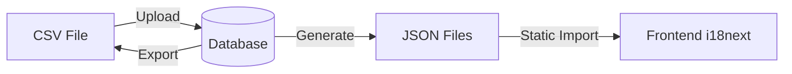

# Database-Driven Translation Management System

Implement a translation management workflow that stores translations in database, supports CSV import/export, and generates JSON files for frontend consumption.

## Flow Diagram



## User Review Required

> [!IMPORTANT]
> **Translation Table Location**: I recommend adding the translations table to the main schema. This will share the same DB as the app.

> [!NOTE]
> **Dev Panel Integration**: The translation management UI will be added to the existing dev-panel at localhost:3333, with endpoints that point directly to the project's locales folder.

---

## Proposed Changes

### Database Schema

#### [NEW] [Translation Table in schema.prisma](file:///Users/charanpreetsingh/LabRecManagemer/server/prisma/schema.prisma)

Add new `Translation` model:
```prisma
model Translation {
  id           String    @id @default(dbgenerated("gen_random_uuid()")) @db.Uuid
  key          String    @db.VarChar(255)   // e.g., "nav.dashboard"
  languageCode String    @map("language_code") @db.VarChar(10)  // e.g., "en", "hi"
  value        String                        // The translated text
  createdAt    DateTime? @default(now()) @map("created_at")
  updatedAt    DateTime? @default(now()) @updatedAt @map("updated_at")

  @@unique([key, languageCode])
  @@index([languageCode])
  @@map("translations")
}
```

---

### Backend Routes (Dev Panel)

#### [MODIFY] [server.js](file:///Users/charanpreetsingh/LabRecManagemer/dev-panel/server.js)

Add translation management endpoints:

1. **`GET /api/translations/export-csv`** - Export all translations as CSV
   - Columns: `key, en, hi, bn, te, mr, ta, gu, kn, ml, or, pa, as, sa, ur, ne, fr, es`
   - Each row is a translation key with values for all languages

2. **`POST /api/translations/import-csv`** - Import CSV and update database
   - Parse CSV, validate structure
   - Upsert translations to database
   - Return count of added/updated translations

3. **`POST /api/translations/generate-json`** - Generate JSON files from database
   - Query all translations grouped by language
   - Convert flat keys (e.g., `nav.dashboard`) to nested JSON structure
   - Write to `client/public/locales/{lang}/common.json`

4. **`POST /api/translations/seed-from-json`** - One-time migration
   - Read existing JSON files
   - Flatten nested keys to dot-notation
   - Insert into database

---

### Dev Panel UI

#### [MODIFY] [index.html](file:///Users/charanpreetsingh/LabRecManagemer/dev-panel/public/index.html)

Add "Translations" section with:
- **Export CSV** button → downloads all translations
- **Import CSV** file input + upload button
- **Regenerate JSON** button → syncs DB to JSON files
- **Seed from JSON** button (one-time) → initial migration
- Status display showing last sync time

---

## Verification Plan

### Manual Verification

1. **Seed Initial Data**:
   - Open dev-panel at `http://localhost:3333`
   - Click "Seed from JSON" to populate database from existing JSON files
   - Verify success message / count

2. **Export CSV**:
   - Click "Export CSV"
   - Open downloaded file, verify columns and translations

3. **Edit & Import CSV**:
   - Modify a value in the CSV (e.g., change `nav.dashboard` in Hindi)
   - Upload via "Import CSV"
   - Click "Regenerate JSON"
   - Check `client/public/locales/hi/common.json` for the updated value

4. **Frontend Verification**:
   - Restart client
   - Switch language to Hindi
   - Verify the changed translation appears in the UI
